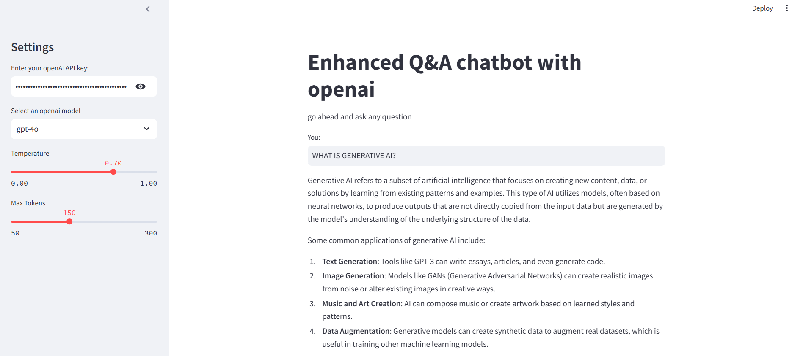

# Enhanced Q&A Chatbot with OpenAI

This project is an advanced, interactive Q&A chatbot application that leverages OpenAI's language models to provide insightful and contextually accurate responses to user queries. The application is built using Streamlit, making it accessible and user-friendly for various use cases such as educational tools, customer support, or even just for fun interactions.

## Table of Contents

1. [Features](#features)
2. [Getting Started](#getting-started)
   - [Prerequisites](#prerequisites)
   - [Installation](#installation)
   - [Setting Up Environment Variables](#setting-up-environment-variables)
3. [Running the Application](#running-the-application)
4. [Usage](#usage)
5. [Screenshot](#screenshot)
6. [Technologies Used](#technologies-used)
7. [Contributing](#contributing)
8. [License](#license)

## Features

- **Model Selection**: Users can choose from a variety of OpenAI models, including `gpt-4o`, `gpt-4-turbo`, and `gpt-4`, to tailor the chatbot's responses to their needs.
- **Customizable Response Parameters**: The application allows users to adjust the `temperature` and `max_tokens` settings:
  - **Temperature**: Controls the creativity of the AI's responses (0.0 for less creativity and 1.0 for maximum creativity).
  - **Max Tokens**: Limits the length of the response, with a range between 50 and 300 tokens.
- **User-Friendly Interface**: The application is built with Streamlit, which provides a clean and intuitive interface for easy interaction.
- **Real-Time Response Generation**: The chatbot responds to user queries in real-time, making it an efficient tool for instant information retrieval.
- **Environment Tracing with LangChain**: The application is configured to utilize LangChain for tracing, allowing for detailed logging and monitoring of AI interactions.

## Getting Started

### Prerequisites

Before you begin, ensure you have the following installed on your local machine:

- **Python 3.8+**: The application is built with Python, so make sure you have the latest version installed.
- **pip**: Python's package installer, which you will use to install the required dependencies.

### Installation

1. **Clone the Repository**:

   Clone this repository to your local machine using the following command:

   ```bash
   git clone <repository_url>
   cd <repository_folder>
    ```
2. **Install the required dependencies:**

```bash
pip install -r requirements.txt
```

3. **Set up your environment variables:**

-Create a .env file in the root directory with the following content:
```bash 
LANGCHAIN_API_KEY=your_langchain_api_key
OPENAI_API_KEY=your_openai_api_key
LANGCHAIN_TRACING_V2=true
LANGCHAIN_PROJECT=Q&A Chatbot with OPENAI
```

## Running the Application
1. Start the Streamlit app:

```bash 
streamlit run app.py
```
2. Enter your OpenAI API key in the sidebar.

3. Select the desired OpenAI model from the dropdown.

4. Adjust the temperature and max tokens using the sliders.

5. Input your query and receive the response generated by the selected model.

## Screenshot


## Requirements
All required dependencies are listed in the `requirements.txt` file.

```bash
streamlit
python-dotenv
langchain-openai
langchain
langchain_community
langchain_core
```

## License
This project is licensed under the MIT License. See the `LICENSE` file for more details.